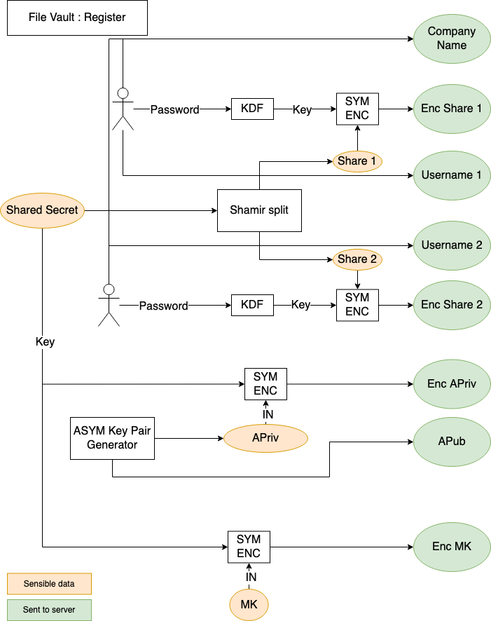
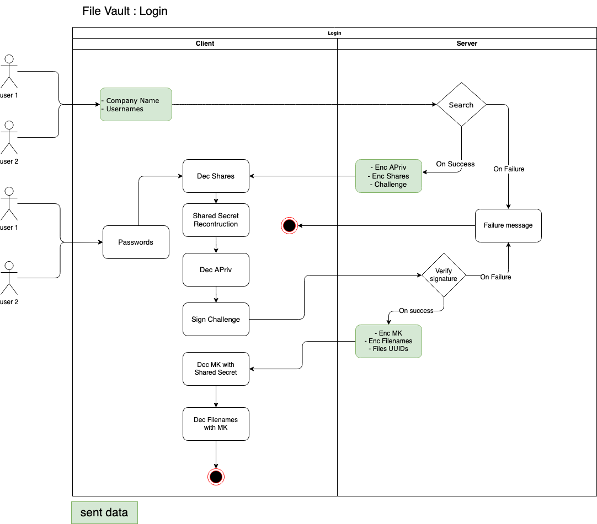
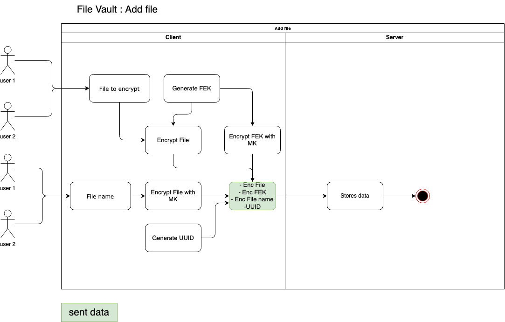
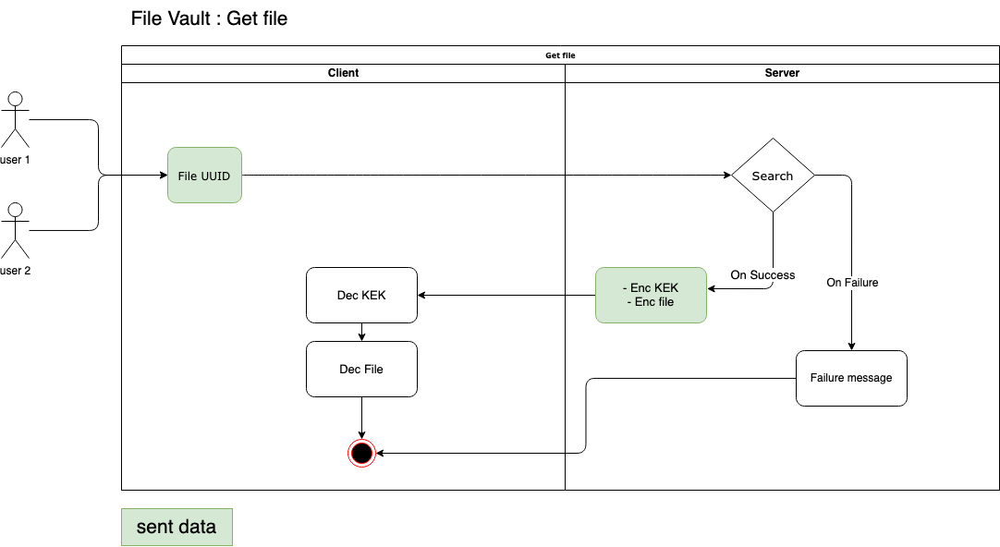
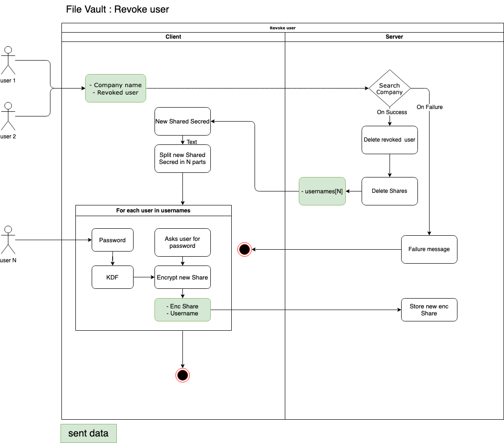
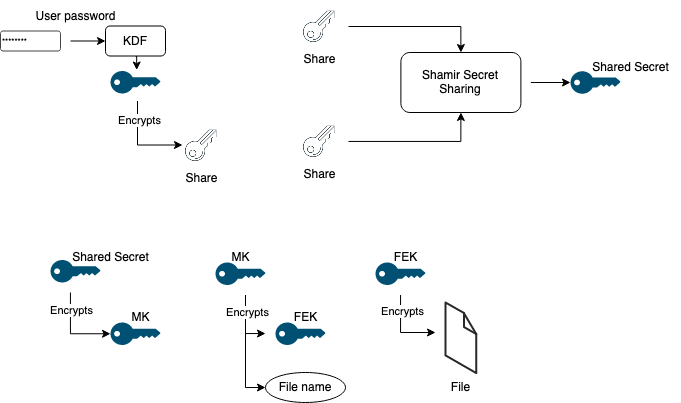

# File Vault js

## Overview

`File Vault js` is client-server application for securely storing files in the cloud. The specificity of this digital vault is that minimum two users are required to unlock the vault. This is done by using Shamir Secret Sharing to split the master key between the users. All the cryptographic operations on files are executed on the client side. The server only stores them. It never has access to the plaintext or the encryption keys.  
This application was initially coded as part of the Applied Cryptography course of the HEIG-VD.  
Here is the list of the original requirements :  
1. We assume a passive adversary. We also assume that the communication channel between the client and the server are not confidential.
2. First, the client needs to authenticate. Since the files are really sensitive, two people out of n need to gather to access a file. The process is the following:
    1. The company sends its company name to the server.
    2. Then, two members of the company (out of n) enter their credentials (username + password)
to unlock the vault.
3. The server is allowed to know the usernames. Beware that the same username might be used by two different companies.
4. Once the client is authenticated, he receives an encrypted list of filenames. He can then select which file he wants.
5. The selected file is sent by the server (still encrypted).
6. The server should never see the documents in clear and should not be able to recover them (assuming “good” passwords).
7. The client should not have to enter more than one password per member.
8. Clients should be able to connect to the vault from any computer and change device as they want.
9. If a document’s encryption key leaks, one should not be able to decrypt other documents.
10. Finally, you need to be able to revoke a user. This should not require the re-encryption of all files.

## Definitions

#### **Company Name**
The name provided at a new company registration process. This name must then be provided at each connection.

#### **Username**
The name of a company user. 

#### **User Password**
Two user passwords with corresponding usernames are required to authenticate a company. A symmetric encryption key is derived from each password with a KDF. These key are used to encrypt the shares.

#### **Master Key (MK)**
The MK is a symmetric encryption key. It encrypts the file names and the FEK Encryption Keys.

#### **Share**
A Share is a point obtained by splitting a secret with Shamir Secret Sharing algorithm. One Share is attributed to each new user. Each share must be unique and must never be transmitted non encrypted over the network or stored non encrypted. The encrypted shares are stored by the server.

#### **Shared Secret**
The `Shared Secret` is used as symmetric encryption key to encrypt the MK.This secret is created at new company registration or at the `Shared Secret` regeneration process. It is never stored. Two `Shares` are required to reconstitute it. Note that number two is determinate by the requirement `2.2`.

#### **File Encryption Key (FEK)**
For each new file stored, a unique symmetric encryption key is generated and this is the FEK. It must never be transmitted non encrypted over the network or stored non encrypted. 

#### **File name**
The `File name` is the name given by user at new encrypted file creation. It must never be transmitted non encrypted over the network or stored non encrypted. 

#### **FEK Encryption Key (FEKEK)**
This key is used to encrypt the FEKs. Each FEK is encrypted with the same `FEK Encryption Key`.

#### **Authentication Private Key (APriv)**
The `Authentication Private Key` is an asymmetric signing key. It is used to authenticate the client from server's perspective. More precisely, it is usefully for "challenge-response" authentication algorithm as challenge-signing key. This key must never be transmitted non encrypted over the network or stored non encrypted. The Shared Secret is used to encrypt and decrypt it.

#### **Authentication Public Key (APub)**
The `Authentication Private Key` is an asymmetric signing key. It is used to authenticate the client from server's perspective. Specifically, the server uses it to verify the signature of the challenge sent to client at authentication time.

## Remarks on requirements

1. Because of requirement number `9`, each file is encrypted with a different `KEK`. 
2. Because of requirement number `6`, the client is in charge of encrypt files and file names. Furthermore, the `KEK` must be encrypted.
3. We chose use Shamir Secret Sharing algorithm because it enables us the possibility to securely share the secret that is necessary to authentication and decrypt a second secret that is used to encrypt the file names and the KEKs. By encrypting the shares with a key derived from user passwords, we respond to requirement number `7`.
4. We don't simply use the `Shared Secret` as MK to provide the possibility of revoke the `Shared Secret` without the need of re-encrypt all the FKE. This is part of the response to requirement number `10`.
5. To revoke a user, it is only possible to change the `Shared Secret` and delete . In fact, this will revoke all the users. So revoke one user requires of all others to reenter their password to encrypt the newly attributed `Share`. 
6. Currently, the protocol doesn't provide the ability to add a new user to an existing company account without revoke the `Shared Secret`.

## Protocol

### Register
#### **Steps**
1. `N` users (minimum 2) provide a company name and respective usernames and passwords.
2. A `Secret Share` is randomly generated. It is split with Shamir Secret Sharing algorithm in `N` `Shares`.
3. A symmetric key is derived from each password. A share is attributed to each user and encrypted with the respective key.
4. `APub` and `APriv` are generated. `APriv` is encrypted with the `Secret Share`.
5. `MK` is generated and encrypted with the `Secret Share`.
6. `Company Name`, encrypted `Shares`, `Usernames`, encrypted `APriv`, `APub` and encrypted `MK` are sent to the server who stores them.

#### **Schema**

> This figure shows only registration with two users. Though it is possible to register N users.
### Login
#### **Steps**
1. Two users provide their `username` with password and their `company name`. This is sent to the server.
2. The server search for the associated `APriv` en encrypted `Shares`. It sends them back to the client, with a challenge to sign.
3. The client asks users for their password. It derives the symmetric keys to decrypt the Shares. Then it reconstitutes the `Shared Secret` and decrypt `Apriv`.
4. The client signs the challenge and send it back to the server.
5. The server verify the signature. On success, it sends the encrypted filenames with associated UUIDs and the `MK` to the client.
6. The client decrypts the `file names` and the `MK`. The server can now accept requests for files and associated keys.
#### **Schema**

### Add a file
#### **Steps**
1. Users provide a file and a file name to the client.
2. The client generates a UUID and a `FEK` randomly.
3. The client encrypts the file with this `FEK`, the file name with the `MK` and the `FEK` with the `FEKEK`.
4. The client sends the encrypted file, the encrypted `FEK` and the UUID to the server.
5. The server stores the encrypted file with the UUID as file name and the encrypted `FEK`.
#### **Schema**

### Get a file
#### **Steps**
1. The users select a file by name.
2. The client sends to server the associated UUID.
3. The server retrieves the encrypted `FEK` and the encrypted file. It sends them back to the client
4. The client decrypts the `FEK` with the `FEKEK` and then the file with the `FEK`.

### Revoke a user
#### **Steps**
1. The client asks the server to delete all encrypted `shares` for the connected company.
2. The server delete all the encrypted `shares` and notify the client.
3. The client generates new shares for all the non revoked users.
4. The client asks all the non revoked users for their password.
5. The client asks for optional new user(s).
6. The client derives the symmetric encryption keys from the passwords, gives a new share to each non revoked user and encrypts the shares.
7. The client send the new encrypted shares to the server.
8. The server stores the new shares. 
#### **Schema**

### Keys
This figure represents on a single view the different encryption keys.

 
 
 

## Possible improvements

### User revocation
An idea came to us when I was almost finished with the implementation of the vault application.
To facilitate the user revocation, we could encrypt the `Shares` with asymmetric cryptography. Instead of directly encrypt the `Share` with the key derived from password, we could encrypt an asymmetric private encryption key. This key would be used to decrypt the `Share`.
The public key would be encrypted by key material derived from `Shared Secret`.  
In this manner, it would be possible for two connected users to:
1. Ask the server for the deletion of the revoked user.
2. Ask the server for the deletion of all users `Shares`.
3. Ask the server for the public encryption key of all users.
4. Decrypt the public keys with the current `Shared Secret`.
5. Generate a new `Shared Secret` and new `Shares` for each non revoked users.
6. For each non revoked user, encrypt the new attributed `Share` with the respective public key.
7. Encrypt public keys with the new `Shared Secret` and send it to the server.
8. Send the newly encrypted `Shares` to the server.   

This would result to a transparent user revocation for all non revoked users. Note that we would encrypt the users public encryption keys to avoid user revocation by non-authenticated actors.

### Add a new user
With the Shamir Secret Sharing it is theoretically possible to add a share to an existing `Shared Secret` without to revoke all `Shares`. To do this, we need to reconstruct the complete equation of the curve of which the `Shares` are points and the `Shared Secret`. The problem is that no existing library provides an API that enable this possibility. Another point is that the requirements don't ask for this functionality.

## Implementation
### Overview
We implemented the described file vault storage protocol with Javascript. The client is a web application running in a browser and the server is an Express Js application running on Node Js. This implies that our file vault storage protocol is built on top of `http`.

### Cryptographic operations
Our protocol does not specify which algorithm to use to encrypt and sign data. The only thing that is really specified is the use of Shamir Secret Sharing algorithm to share the secret that unlock the vault.
For this POC application, we decided to use the standard W3C [Web Crypto API](https://developer.mozilla.org/en-US/docs/Web/API/Web_Crypto_API). It offers few algorithms but all we need. The interest of this API is also that it is available on Node (from version 15).

#### Symmetric encryption
First we decided to use authenticated encryption to ensure in same time confidentiality, authenticity and integrity of data. The Web Crypto API offers for this purpose only GCM. It is not a problem because this is a good algorithm, although we have to pay intention to the IV management and the data size limit due to the standard 32 bits length of the counter for CTR encryption mode.  
In short:
- **Key length :** 256 bits to allow secured long-time file storage.
- **IV length :** 96 bits (default)
- **Counter length :** 32 bits (default)
- **IV generation :** random
- **Theoretical data size limit :** ~64 GB
- **Max number of encryption with the same key :** 232, with a probability less than 2-32 to have a repeated IV (NIST recommendation).
- The IVs is stored beside the key.
- The Web Crypto API includes the GCM TAG with the cipher text. We decided to not separate for development ease.  
  
It is important to note the max number of encryption. For our usage, it is only problematic for the `MK` because it is the only key that may be reused for a big amount of encryption. However, we felt that this was not a problem for our POC application, though a key rotation feature should be included in the reflections for future improvements. For the moment, given that the `MK` is used to encrypt both `File Name` and `FEK`, one company could safely encrypt 216 files. Note that an easy way to double this amount should use two different keys to encrypt the `File Name` and `FEK`. This would also be a good key management practice (one key for one usage). Lastly, note that we presently don't count the number of encryption by keys because of limited time to develop our POC application.

#### Asymmetric signature
For this usage, the Web Crypto API provides RSA-PSS, RSASSA-PKCS1-v1_5 and ECDSA algorithms. We chose ECDSA to benefit from the shorter key length than RSA thanks to elliptic curve use. The two things that the API let us chose is the curve type and the hash algorithm, because the `sign` method performs a hash before signing. For hash algorithm, we had to chose between SHA-256, SHA-384 and SHA-512 (all sha2 algorithms). The fact is that we use a 128 bits random UUID as challenge, so it should be non-necessary to hash it. So we chose SHA-256 because it would be useless to generate a bigger digest from a 128 bits value.  
Regarding the elliptic curve choice, the NIST recommendation is P-256 for middle-term security. We chose P-384 for the bit higher security it offers and the very small impact in terms of performance and storage usage it implies.
In short:
- EC type : P-384
- Digest alg : SHA-256

#### KDF for password
Here the only possibility given by Web Crypto API as password-based key derivation function is PBKDF2. There is no reason to not use it, so we adopted it. When using PBKDF2, the three main attention points are the pseudo-random function (PRF), the iteration count (c) and the salt generation. The output length is fixed to 256 bits because we want to generate 256 bits symmetric encryption key.
- **PRF:** Web Crypto API uses HMAC. We only had to discuss the hash size. Given the output size we chose SHA-256.
- **c :** here we have to think about the threat model. The server never see the password. To authenticate a client, it is forced to send encrypted shares when an existing combination of company name and usernames is provided. If an attacker guess such information, he will be able to query the server for encrypted shares and then perform a brute force attack offline to find values that permit the `Share` decryption. He could then try to reconstitute the `Shared Secret`. We consider that it is a very plausible case. There is three ways to protect the user of this threat:  
  1. Force random company name and usernames. But this would degrade the user experience.
  2. Chose a high value for `c`.  
   
    We decided to not degrade UX and chose 1.000.000 as iteration count to ensure that it would be **very** difficult to find the `Shared Secret`.

- **Salt :** to avoid dictionary attack, we generate a random salt for each user and store it beside  the username on server side.

### Authentication
- To authenticate user, we use JWT. These token have 1 hour validity. On the server side, the validity of JWT is verified for `/masterkey/*` and `/file/*` endpoints.
- The client adds the JWT in `Authentication` http header.

### Development
You may find the code on [GitHub](https://github.com/superjeffcplusplus/file-vault-js).